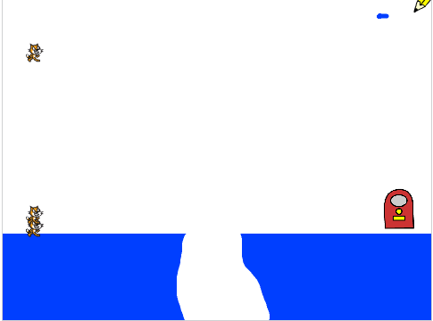

## استنساخ القطط

ستحتاج تدفق لا ينتهي من القطط التي يجب على اللاعب توجيهها على طول المسار إلى المخرج.

\--- task \---

انقر على الكائن المسمى 'Cat'، وأضف بعض التعليمات البرمجية لـ `إخفاء`{:class="block3looks"} الكائن، وأيضاً لـ `نسخها`{:class="block3looks"} كل ثلاث ثوان.


```blocks3
when flag clicked
hide
forever
    create clone of (myself v)
    wait (3) seconds
end
```

\--- /task \---

إذا قمت بتشغيل البرنامج الآن، فلن يحدث شيء على المنصة. للتأكد من إنشاء نسخة من كائن القط كل ثلاث ثوان، اجعل كل كائن يظهر ويسقط من السماء.

\--- task \---

أضف كتلة برمجية لإخبار الكائن أنه `عندما تبدأ نسخة منه`{:class="block3control"}، يجب أن أن `تظهر`{:class="block3looks"} نفسها وتسقط حتى `تلامس`{:class="block3sensing"} الأرضية الزرقاء المرسومة على المنصة.


\--- hints \--- \--- hint \---

`عندما يبدأ الكائن كنسخة`{:class="block3control"}, `أظهر`{:class="block3looks"} الكائن. `غير`{:class="block3motion"} الموضع `ص` للكائن `بشكل متكرر`{:class="block3control"} بمقدار `-2` حتى `يلامس`{:class="block3sensing"} الكائن المنصة الرزرقاء.

\--- /hint \---

\--- hint \---

هنا التعليمات البرمجية التي ستحتاج اليها:

```blocks3
repeat until <>
end

show

<touching color [#0000ff]?>

change y by (-2)

when I start as a clone
```

\--- /hint \---

\--- hint \---

و هذا ما يجب أن تبدو عليه التعليمات البرمجية الخاصة بك:

```blocks3
when I start as a clone
show
repeat until <touching color [#0000ff]?>
change y by (-2)
end
```

\--- /hint \--- \--- /hints \---

\--- /task \---

عندما تنقر على العلم الأخضر، يجب أن ترى قطة جديدة تسقط من أعلى المسرح كل ثلاث ثوانٍ. يجب أن تهبط كل قطة في كومة كبيرة من القطط المتداخلة على الأرضية الزرقاء في الأسفل.

