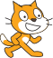

## Fes moure els gats

Una vegada que un gat arriba al terra, hauria de passar lentament cap a la dreta.

--- task ---

Afegeix codi a la secció `quan començo com a clon`{:class="block3control"} per fer que el gat es `mogui deu passos`{:class="block3motion"} i canvia entre els dos vestits del personatge cada 0,1 segons fer que el gat sembli que camini.



--- hints ---
 --- hint ---

El personatge del gat s'hauria de `moure 10 passos`{:class="block3motion"} i `canviar de vestit`{:class="block3looks"} cada `0,1 segons`{:class="block3control"}. Aquest codi s'hauria de repetir `per sempre`{:class="block3control"}, de la mateixa manera que el codi per fer caure el gat.

--- /hint ---

--- hint ---

Aquí tens els blocs que necessites:

```blocks3
move (10) steps

wait (0.1) seconds

next costume

forever
end
```

--- /hint ---

--- hint ---

Així és com s'hauria de veure el teu codi:

```blocks3
when I start as a clone
show
+ forever
    move (10) steps
    repeat until <touching color [#0000ff]?>
        change y by (-2)
    end
    next costume
    wait (0.1) seconds
end
```

--- /hint ---

--- /hints --- --- /task ---

--- task ---

Prem la bandera verda i comprova que els gats es mouen per la plataforma blava de la part inferior.

--- /task ---

Si dibuixes un pont que tapi la bretxa perquè els gats puguin anar fins al costat dret de l’Escenari, pots veure que s’acaben enganxant caminant per la paret dreta.


--- task ---

Elimina el bucle `per sempre`{:class="block3control"}, i afegeix en el seu lloc un bucle diferent perquè els gats només caminin fins que arribin a la vora. Quan un gat arriba a la vora de l’Escenari, hauria de desaparèixer.


```blocks3
when I start as a clone
show
+ repeat until <touching (edge v)?>
    move (10) steps
    repeat until <touching color [#0000ff]?>
        change y by (-2)
    end
    next costume
    wait (0.1) seconds
end
+ delete this clone
```

--- /task ---

--- task ---

Prem la bandera verda i comprova que els gats desapareixen quan arriben a la vora de l’Escenari.

--- /task ---

Pots observar que, si els gats cauen al forat, no desapareixen sinó que es queden enganxats a la part inferior. Això és perquè continuen intentant caure cap avall.

Aquesta és la part del codi que indica que el gat continuï caient fins que toqui el blau:

```blocks3
repeat until <touching color [#0000ff]?>
end
```

Tot i això, al forat, el gat no pot arribar mai al blau, de manera que queda enganxat per sempre.

--- task ---

Afegeix més blocs a aquest bucle de manera que es repeteixi fins que el personatge del gat toqui el blau `o`{:class="block3operators"} `toqui la vora`{:class="block3sensing"}. D’aquesta manera, el personatge deixa d’intentar caure si arriba a la vora de l’Escenari.


```blocks3
repeat until <<touching color [#0000ff]?> or <touching (edge v)?>>
end
```

--- /task ---