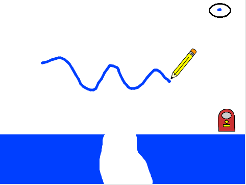

## Ζωγράφισε γραμμές

--- task ---

Άνοιξε το έργο Scratch "ΓΑΤΕΣ!".

**Online:** άνοιξε το αρχικό έργο στο [scratch.mit.edu/projects/382452871](https://scratch.mit.edu/projects/382452871){:target="_blank"}.

Αν έχεις λογαριασμό Scratch μπορείς να δημιουργήσεις ένα αντίγραφο κάνοντας κλικ στο **Ανάμειξη**.

**Offline**: άνοιξε το [αρχικό έργο](http://rpf.io/p/el-GR/cats-go) στον επεξεργαστή εκτός σύνδεσης. Αν χρειαστεί να κατεβάσεις και να εγκαταστήσεις τον offline editor για το Scratch, μπορείς να το βρεις στο [rpf.io/scratchoff](http://rpf.io/scratchoff){:target="_blank"}.

--- /task ---

--- task ---

Πρόσθεσε την επέκταση πένας στο έργο σου.

[[[generic-scratch3-add-pen-extension]]]

--- /task ---

--- task ---

Κάνε κλικ στο αντικείμενο που ονομάζεται 'Pen' και πρόσθεσε τον κώδικα για να ρυθμίσεις το χρώμα του στυλό στο ίδιο μπλε με τα εμπόδια στη σκηνή.


```blocks3
when flag clicked
set pen color to [#0000ff]
erase all
set pen size to (5)
```

Για να επιλέξεις ένα χρώμα, κάνε κλικ στο τετράγωνο χρώματος στο μπλοκ `επέλεξε χρώμα στυλό`{:class="block3extensions"} για να κάνεις τον δείκτη του ποντικιού σου να μοιάζει με σταγονόμετρο, και στη συνέχεια κάνε κλικ στο σωστό χρώμα στη σκηνή.

--- /task ---

--- task ---

Πρόσθεσε κάποιο άλλο κωδικό για να κάνεις το αντικείμενο να ακολουθεί τον δείκτη του ποντικιού. Δοκίμασε το πρόγραμμά σου για να ελέγξεις ότι ο κώδικας λειτουργεί.


```blocks3
forever
go to (mouse pointer v)
end
```

[[[generic-scratch3-saving]]]

--- /task ---

--- task ---

Πρόσθεσε κώδικα για να πεις στο αντικείμενο να σχεδιάσει μια γραμμή στη σκηνή αν πατηθεί το κουμπί του ποντικιού.


--- hints ---
 --- hint ---

`Αν`{:class="block3control"} το `ποντίκι είναι κάτω`{:class="block3sensing"}, τοποθέτησε το `στυλό κάτω`{:class="block3extensions"}, και `αλλιώς`{:class="block3control"}, σήκωσε το `στυλό πάνω`{:class=" block3extensions"}.

--- /hint ---

--- hint ---

Εδώ είναι τα μπλοκ κώδικα που χρειάζεσαι:

```blocks3
<mouse down?>

pen down

pen up

if <> then
else
end
```

--- /hint ---

--- hint ---

Έτσι πρέπει να μοιάζει ο κώδικας:

```blocks3
when flag clicked
set pen color to [#0000ff]
erase all
set pen size to (5)
forever
go to (mouse pointer v)
+ if <mouse down?> then
pen down
else
pen up
end
```

--- /hint ---

--- /hints --- --- /task ---

--- task ---

Δοκίμασε τον κώδικά σου. Θα πρέπει να μπορείτε να κάνεις κλικ και να σύρεις με το ποντίκι για να σχεδιάσεις μια μπλε γραμμή στη σκηνή.



--- /task ---

Πιθανότατα να δεις ότι μια μπλε κουκκίδα εμφανίζεται πάντα στην πάνω δεξιά γωνία της σκηνής (είναι κυκλωμένη στην εικόνα παραπάνω). Αυτό συμβαίνει επειδή, όταν κάνεις κλικ στην πράσινη σημαία για να ξεκινήσεις το παιχνίδι, πατάς το ποντίκι κάτω και έτσι το στυλό αρχίζει αμέσως να σχεδιάζει.

--- task ---

Για να μην αφήσεις να συμβεί αυτό, πρόσθεσε ένα μπλοκ `πένα πάνω`{:class="block3extensions"} κατά την έναρξη του σεναρίου, και ένα μπλοκ `περίμενε ένα δευτερόλεπτο`{:class="block3control"} πάνω από το μπλοκ `για πάντα`{:class="block3control"}.


```blocks3
when flag clicked
+ pen up
set pen color to [#0000ff]
erase all
set pen size to (5)
+ wait (1) seconds
forever
go to (mouse pointer v)
if <mouse down?> then
pen down
else
pen up
end
```

--- /task ---