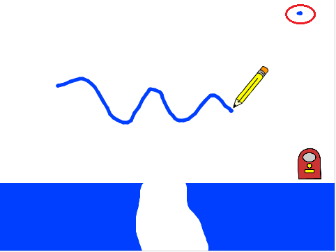

## Drawing lines

--- task ---
Open the 'CATS!' starter project.

**Online:** Open the 'CATS!' Scratch starter project at [jumpto.cc/cats-go](http://jumpto.cc/cats-go){:target="_blank"}. You can click on 'Remix' in the top right-hand corner to save a copy of the project if you have a Scratch account.

**Offline:** Open the [starter project](resources/cats-resources.sb) in the offline editor. If you need to download the Scratch offline editor you will find it at [rpf.io/scratchoff](http://rpf.io/scratchoff){:target="_blank"}.

--- /task ---

--- task ---
Click on the sprite called **Pen**, and add code to set the pen colour to the same blue as the obstacles on the stage.

```blocks
when flag clicked
set pen color to #0000ff
clear
set pen size to (5)
```

You can select a colour by clicking on the colour block to get the pipette cursor, followed by clicking on the colour you want on the stage.

--- /task ---

--- task ---
Add some more code to make the sprite follow the mouse pointer. Test your program to check that the code works.

```blocks
forever
go to [mouse pointer v]
end
```

[[[generic-scratch-saving]]]

--- /task ---

--- task ---
Add some code to tell the sprite to draw a line on the stage if the mouse button is pressed down.

--- hints ---
--- hint ---
`If`{:class="blockcontrol"} the `mouse is down`{:class="blocksensing"}, put the `pen down`{:class="blockpen"}. `Else`{:class="blockcontrol"} put the `pen up`{:class="blockpen"}.
--- /hint ---

--- hint ---
Here are the code blocks you'll need:

```blocks
<mouse down?>

pen down

pen up

if <> then
else
end
```
--- /hint ---

--- hint ---
This is what your code should look like:

```blocks
when flag clicked
set pen color to #0000ff
clear
set pen size to (5)
forever
go to [mouse pointer v]
if <mouse down?> then
pen down
else
pen up
end
```
--- /hint ---

--- /hints ---
--- /task ---

--- task ---
Test your code. You should be able to click and drag with the mouse to draw a blue line on the screen.



--- /task ---

You will probably notice that a blue dot always appears in the top right corner of your stage (circled). This is because when you click the green flag to start the game, the mouse is pressed down so the pen immediately starts drawing.

--- task ---
Add a block to wait one second before the `forever` block to stop this from happening.

```blocks
when flag clicked
set pen color to #0000ff
clear
set pen size to (5)
+ wait (0.5) secs
```
--- /task ---
