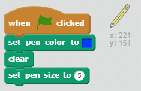
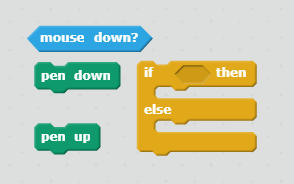
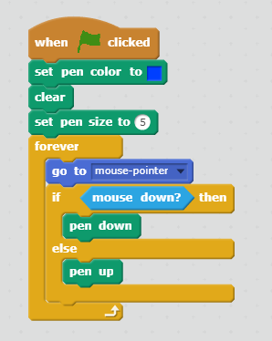
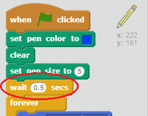

## Drawing lines

+ Open the starter project

--- collapse ---
---
title: I'm using Scratch online
---

+ Open the 'CATS!' Scratch starter project at [jumpto.cc/cats-go](http://jumpto.cc/cats-go){:target="_blank"}.

+ If you have a Scratch account, you can click on **Remix** in the top right-hand corner to save a copy of the project to your account.

--- /collapse ---

--- collapse ---
---
title: I'm using Scratch offline
---

Download the [cats.sb2](resources/cats.sb2){:target="_blank"} Scratch starter project, and open it using the offline editor.

--- /collapse ---

+ Click on the sprite called **Pen**, and add code to set the pen colour to the same blue as the obstacles on the stage. Clear the screen and set the pen size to 5.

You can select a colour by clicking on the colour block (circled) to get the pipette cursor, followed by clicking on the colour you want on the stage.

+ Add some more code to make the sprite follow the mouse pointer. Test your program to check that the code works.

[[[generic-scratch-saving]]]

+ Add some code to tell the sprite to draw a line on the stage if the mouse button is pressed down.

--- hints ---
--- hint ---
`If` the `mouse is down`, put the `pen down`. `Else` put the `pen up`.
--- /hint ---

--- hint ---
Here are the code blocks you'll need:

--- /hint ---

--- hint ---
This is what your code should look like:

--- /hint ---

--- /hints ---

+ Test your code. You should be able to click and drag with the mouse to draw a blue line on the screen.

You will probably notice that a blue dot always appears in the top right corner of your stage (circled in red). This is because when you click the green flag to start the game, the mouse is pressed down so the pen immediately starts drawing.

+ Add a block to wait one second before the `forever` block to stop this from happening.

