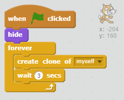
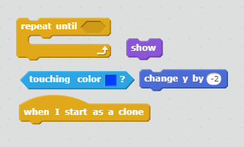
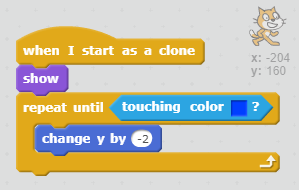

## Cloning cats

We want to generate an infinite stream of cats to guide along the path to the exit.

+ Click on the sprite called 'Cat' and add some code to make the sprite invisible, but also to clone itself every 3 seconds

If you run the program at the moment, nothing will happen. Let's make the cats fall down so we can see that a new one is being created every 3 seconds.

+ Add some code to tell the sprite that when it starts as a clone, it should become visible and fall until it reaches the blue floor which is drawn on the stage

--- hints ---
--- hint ---
**When the sprite starts as a clone**
**show** the sprite,
**repeat** until **touching** the blue stage
**change** the y coordinate of the sprite by -2
--- /hint ---

--- hint ---
Here are the code blocks you'll need

--- /hint ---

--- hint ---
This is what your code should look like:

--- /hint ---

--- /hints ---
