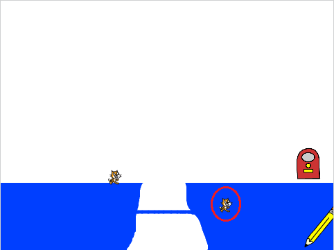
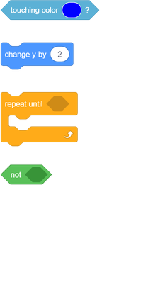
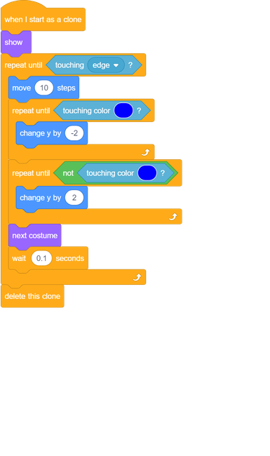

## Stick to the lines

You might notice that, if you draw a low bridge between the two platforms, or a line that slopes upwards, the cats end up walking through the platform rather than on top of it!

--- task ---
In the code for the cat sprite, add another loop before the `next costume`{:class="block3looks"} block. This time, the loop should tell the cat to move upwards by `2` until it is not touching blue.

--- hints ---
--- hint ---
The cat should `move up 2`{:class="block3motion"} `repeatedly until`{:class="block3control"} it is `not`{:class="block3operators"} `touching blue`{:class="block3sensing"}.
--- /hint ---

--- hint ---
Here are the code blocks you need:

--- /hint ---

--- hint ---
This is what your code should look like:

--- /hint ---

--- /hints ---
--- /task ---

--- task ---
Click the green flag and try drawing a line that slopes upwards. Check that your cat follows this line.
--- /task ---
