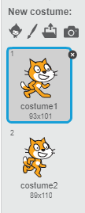
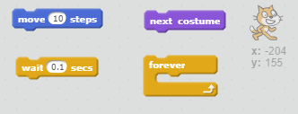
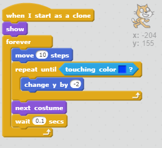
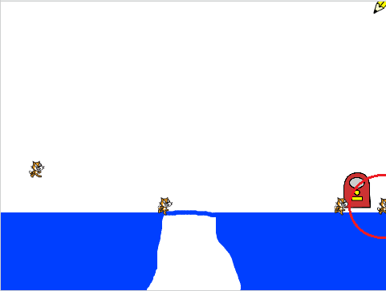
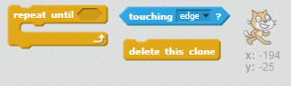
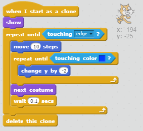
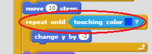
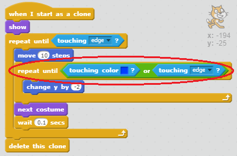

## Moving cats

When a cat has appeared and fallen until it reaches the floor, we want it to step slowly to the right.

+ Add some code to the `when I start as a clone` section to make the cat sprite move ten steps, and switch between the two costumes every 0.1 seconds to make it look like the cat is walking.

--- hints ---
--- hint ---
The cat sprite should `move 10 steps`, and `switch costume` every `0.1 seconds`. This code (as well as the code to make the cat fall) should repeat `forever`.
--- /hint ---

--- hint ---
Here are the code blocks you'll need:

--- /hint ---

--- hint ---
This is what your code should look like:

--- /hint ---

--- /hints ---

+ Press the green flag and check that the cats now move along the blue platform at the bottom.

You will notice that, if you draw a bridge across the gap so that the cats can get all the way to the right edge of the screen, they end up getting stuck walking into the wall.

+ Remove the forever loop you added, and instead add a different loop to make the cats only walk until they reach an edge. When a cat reaches the edge of the screen, it should disappear.

--- hints ---
--- hint ---
Remove the forever loop and replace it with a different loop which repeats `until the cats are touching the edge`. Once they reach an edge, add a block to `delete the clone`, which will make the cat disappear.
--- /hint ---

--- hint ---
Here are the new code blocks you'll need to add:

--- /hint ---

--- hint ---
This is what your code should look like:

--- /hint ---

--- /hints ---

+ Press the green flag and check that the cats disappear when they reach the edge of the screen.

You might notice that the cats don't disappear properly if they fall into the hole, they just get stuck at the bottom. This is because the sprite is getting stuck trying to fall!

This code tells the cat to keep falling until it touches blue. However, in the hole the cat will never reach blue, so it is stuck forever.

+ Add more blocks to this loop to tell it to repeat until it is touching blue `or touching the edge`. This way, the sprite will stop trying to fall if it reaches the edge of the screen.

