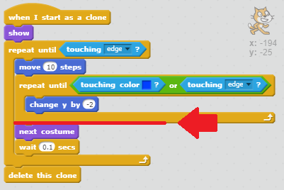
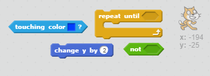
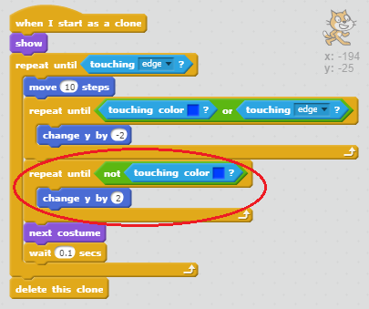

## Sticking to the lines

When testing your game, you might notice that if you draw a low bridge between the two platforms, or a line that slopes upwards, the cats end up walking through the platform rather than on top of it!

+ In the code for the cat sprite, add another loop after the loop which makes the cat fall. This time, the loop should tell the cat to move upwards by two until it is not touching blue.

--- hints ---
--- hint ---
The cat should`move up 2`, and this should `repeat until it is not touching blue`.
--- /hint ---

--- hint ---
Here are the code blocks you'll need:

--- /hint ---

--- hint ---
This is what your code should look like:

--- /hint ---

--- /hints ---

+ Click the green flag and try drawing a line which slopes upwards. Check that your cat follows the line.
