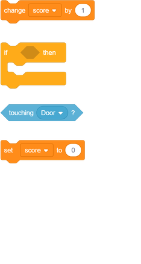
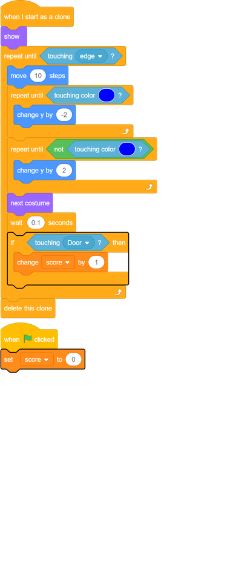
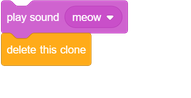

## Get to safety

The object of the game is to guide the cats to safety by creating a path so they can reach the door. Create a score variable to keep track of how many cats reach the door.

--- task ---
Create a variable called `score`{:class="block3variables"}.

[[[generic-scratch3-add-variable]]]

--- /task ---

--- task ---
Add code to your cat sprite to add `1` to the `score`{:class="block3variables"} each time a cat reaches the door. Also set `score`{:class="block3variables"} to `0` `when the flag is clicked`{:class="block3events"} at the start of the game.

--- hints ---
--- hint ---
`If`{:class="block3control"} the cat is `touching the door sprite`{:class="block3sensing"}, then `add 1 to the score`{:class="block3variables"}.
--- /hint ---

--- hint ---
Here are the new code blocks you need to add to your `when I start as a clone` script:

--- /hint ---

--- hint ---
This is what your code should look like:

--- /hint ---

--- /hints ---

--- /task ---

--- task ---
Add some more code so that, when a cat sprite reaches the door, the cat makes a 'meow' sound and then disappears.

--- /task ---
