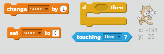
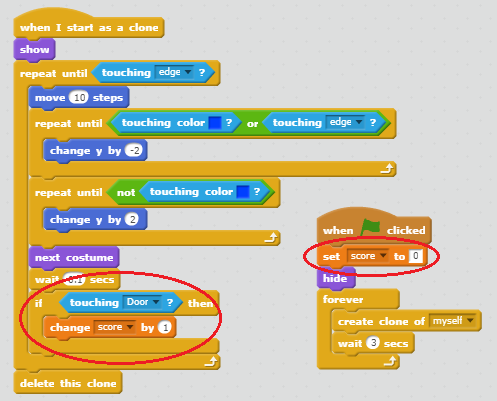
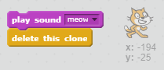

## Getting to safety

The object of the game is to guide the cats to safety by creating a safe path for them to reach the door. Let's make a score variable to keep track of how many cats have successfully reached the door.

+ Create a variable called **score**

[[[generic-scratch-add-variable]]]

+ Add some code to your cat sprite to add one to the score each time a cat reaches the door. Don't forget to also set the score to 0 at the start of the game.

--- hints ---
--- hint ---
**If** the cat is **touching the door sprite** then **add 1 to the score**.
--- /hint ---

--- hint ---
Here are the new code blocks you'll need to add:

--- /hint ---

--- hint ---
This is what your code should look like:

--- /hint ---

--- /hints ---

+ Add some more code so that a cat successfully reaching the door makes a *meow* sound, and then the sprite disappears

