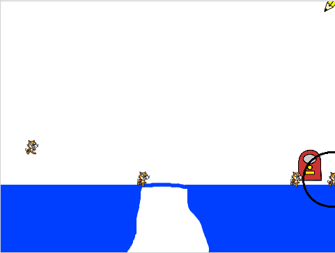

## Fai muovere i gatti

Una volta che un gatto raggiunge il pavimento, dovrebbe spostarsi lentamente verso destra.

--- task ---

Aggiungi del codice alla sezione `quando vengo clonato`{:class="block3control"} per far `muovere dieci passi`{:class="block3motion"} allo sprite del gatto e per far cambiare tra i due costumi dello sprite ogni 0.1 secondi per far sembrare che il gatto stia camminando.


--- hints ---
 --- hint ---

Lo sprite del gatto dovrebbe `muovere 10 passi`{:class="block3motion"} e `cambiare costume`{:class="block3looks"} ogni `0.1 secondi`{:class="block3control"}. Questo codice si dovrebbe ripetere `per sempre`{:class="block3control"}, proprio come il codice per far cadere il gatto.

--- /hint ---

--- hint ---

Ecco i blocchi di codice che ti servono:

```blocks3
move (10) steps

wait (0.1) seconds

next costume

forever
end
```

--- /hint ---

--- hint ---

Ecco come dovrebbe apparire il tuo codice:

```blocks3
when I start as a clone
show
+ forever
    move (10) steps
    repeat until <touching color [#0000ff]?>
        change y by (-2)
    end
    next costume
    wait (0.1) seconds
end
```

--- /hint ---

--- /hints --- --- /task ---

--- task ---

Premi la bandiera verde e controlla che i gatti si muovano ora lungo la piattaforma blu in basso.

--- /task ---

Se disegni un ponte attraverso lo spazio in modo che i gatti possano arrivare fino alla parte destra dello Stage, puoi vedere che finiscono per rimanere bloccati mentre camminano nella parete destra.



--- task ---

Rimuovi il ciclo `per sempre`{:class="block3control"} e aggiungi invece un ciclo diverso per far camminare i gatti solo fino a raggiungere un bordo. Quando un gatto raggiunge il bordo dello Stage, dovrebbe scomparire.


```blocks3
when I start as a clone
show
+ repeat until <touching (edge v)?>
    move (10) steps
    repeat until <touching color [#0000ff]?>
        change y by (-2)
    end
    next costume
    wait (0.1) seconds
end
+ delete this clone
```

--- /task ---

--- task ---

Premi la bandiera verde e verifica che i gatti scompaiano quando raggiungono il bordo dello Stage.

--- /task ---

Potresti notare che, se i gatti cadono nel buco, non scompaiono ma rimangono bloccati sul fondo. Questo perché continuano a cercare di cadere verso il basso.

Questa è la parte del codice che dice al gatto di continuare a cadere fino a quando non tocca il blu:

```blocks3
repeat until <touching color [#0000ff]?>
end
```

Comunque, nella buca, il gatto non può mai raggiungere il blu, quindi è bloccato per sempre.

--- task ---

Aggiungi più blocchi a questo ciclo in modo che si ripeta fino a quando lo sprite del gatto non tocca il blu `o`{:class="block3operators"} `tocca il bordo`{:class="block3sensing"}. In questo modo, lo sprite smette di provare a cadere se raggiunge il bordo dello Stage.


```blocks3
repeat until <<touching color [#0000ff]?> or <touching (edge v)?>>
end
```

--- /task ---