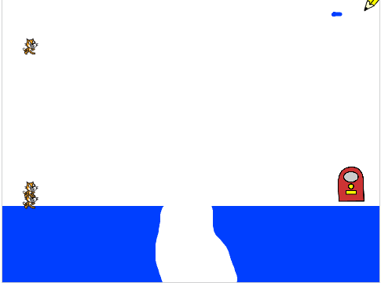

## Clonar gatos

Você quer um fluxo interminável de gatos que o jogador precisa guiar ao longo do caminho até a saída.

\--- task \---

Clique no ator chamado 'Gato' e adicione algum código para que se `esconda`{:class="block3looks"} o ator, e também para `crie clone de ()`{:class="block3control"} a cada três segundos.


```blocks3
quando bandeira verde for clicado
esconda
sempre
    crie clone de (este ator v)
    espere (3) seg
fim
```

\--- /task \---

Se você executar o programa agora, nada acontece no palco. Para verificar se um novo clone do ator Gato é criado a cada três segundos, faça com que cada clone apareça e caia do céu.

\--- task \---

Adicione código para dizer ao ator que `quando eu começar como um clone`{:class="block3control"}, ele se `mostre`{:class="block3looks"} e caia até que ele `toque`{:class="block3sensing"} o chão azul desenhado no palco.


\--- hints \--- \--- hint \---

`quando eu começar como um clone`{:class="block3control"}, `mostre`{:class="block3looks"} o ator. `Repeatedly`{:class="block3control"} `Change`{:class="block3motion"} the sprite's `y` coordinate by `-2`, until the sprite `touches`{:class="block3sensing"} the blue Stage.

\--- /hint \---

\--- hint \---

Here are the code blocks you need:

```blocks3
repeat until <>
end

show

<touching color [#0000ff]?>

change y by (-2)

when I start as a clone
```

\--- /hint \---

\--- hint \---

This is what your code should look like:

```blocks3
when I start as a clone
show
repeat until <touching color [#0000ff]?>
change y by (-2)
end
```

\--- /hint \--- \--- /hints \---

\--- /task \---

When you click the green flag, you should see a new cat fall from the top of the Stage every three seconds. Every cat should land in a big pile of overlapping cats on the blue floor at the bottom.

