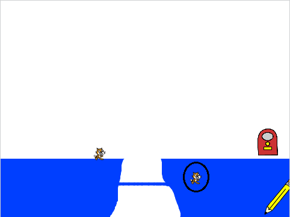

## Ficar nas linhas

Você pode ter notado que, se você desenhar uma ponte baixa entre as duas plataformas, ou uma linha que inclina para cima, os gatos acabam por caminhar através da plataforma e não por cima dela!



\--- task \---

No código do ator Gato, adicione outro laço antes do bloco `próxima fantasia` {:class="block3looks"}. Desta vez, o laço deve dizer ao gato para subir `2` até não tocar na cor azul.


\--- hints \--- \--- hint \---

O gato deve `subir 2`{:class="block3motion"} de maneira `repetida até que`{:class="block3control"} esteja `não`{:class="block3operators"} `tocando na cor azul`{:class="block3sensing"}.

\--- /hint \---

\--- hint \---

Aqui estão os blocos de código que você precisa:

```blocks3
<touching color [#0000ff]?>

change y by (2)

repeat until <>
end

not <>
```

\--- /hint \---

\--- hint \---

This is what your code should look like:

```blocks3
when I start as a clone
show
repeat until <touching (edge v)?>
    move (10) steps
    repeat until <touching color [#0000ff]?>
        change y by (-2)
    end
    repeat until <not <touching color [#0000ff]?>>
        change y by (2)
    end
    next costume
    wait (0.1) seconds
end
delete this clone
```

\--- /hint \---

\--- /hints \--- \--- /task \---

\--- task \---

Click the green flag and try drawing a line that slopes upwards. Check that your cat follows this line.

\--- /task \---