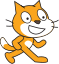

## Pojdi na varno

Cilj igre je, da mače povedeš na varno, tako da ustvariš pot po kateri lahko pridejo do vrat. Ustvari spremenljivko za točke, ki bo štela, koliko mačk pride do vrat.

\--- task \---

Create a variable called `score`{:class="block3variables"}.



[[[generic-scratch3-add-variable]]]

\--- /task \---

\--- task \---

Add code to your cat sprite to add `1` to the `score`{:class="block3variables"} each time a cat reaches the door. Also set `score`{:class="block3variables"} to `0` `when the flag is clicked`{:class="block3events"} at the start of the game.


\--- hints \--- \--- hint \---

`If`{:class="block3control"} the cat is `touching the door sprite`{:class="block3sensing"}, then `add 1 to the score`{:class="block3variables"}.

\--- /hint \---

\--- hint \---

Here are the new code blocks you need to add to your `when I start as a clone` script:

```blocks3
spremeni [točke v] za (1)

če <> potem
konec

&lt: se dotika (Vrata v)?>

nastavi [točke v] na (0)
```

\--- /hint \---

\--- hint \---

This is what your code should look like:

```blocks3
ko začnem kot dvojnik
pokaži
ponavljaj do <se dotika (roba v) ?>
  pojdi (10) korakov
  ponavljaj do <se dotika barve [#0000ff] ?> 
    spremeni y za (-2)
  end
  ponavljaj do <ne <se dotika barve [#0000ff] ?>>>
    spremeni y za (2)
  end
  naslednji videz
  počakaj (0.1) sekund
+  če <se dotika (Vrata v) ?> potem 
    spremeni [točke v] za (1)
  end
end
zbriši tega dvojnika

ko je kliknjena zelena zastavica

+ nastavi [točke v] na (0)
```

\--- /hint \---

\--- /hints \---

\--- /task \---

\--- task \---

Add some more code so that, when a cat sprite reaches the door, the cat makes a 'meow' sound and then disappears.


```blocks3
play sound (meow v)
delete this clone
```

\--- /task \---